# Claude Code ตั้งค่า

## คู่มือใช้งาน CC-Switch กับ TinyToken

**CC-Switch ใช้งาน** · 2026/6/8 · อ่านไม่เกิน 5 นาที

คู่มือใช้งาน CC-Switch กับ TinyToken สำหรับ Claude Code

## สรุปก่อนเริ่ม

คู่มือนี้ใช้สำหรับตั้งค่า Claude Code ให้เรียก API ผ่าน TinyToken โดยใช้ CC-Switch เป็นตัวจัดการ Provider

## 1. ดาวน์โหลดและเปิด CC-Switch

ไปที่หน้า GitHub Release ของ CC-Switch แล้วดาวน์โหลดไฟล์สำหรับระบบของคุณ เช่น Windows ให้ใช้ไฟล์ .msi จากนั้นติดตั้งและเปิดโปรแกรม

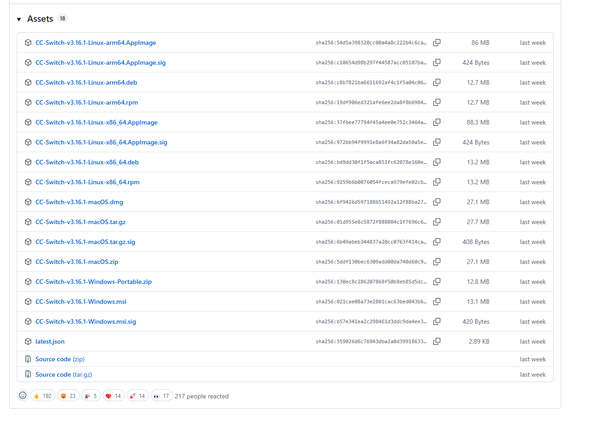

เลือกไฟล์ติดตั้ง CC-Switch จากหน้า Assets

## 2. เปิดหน้า Claude ใน CC-Switch

เมื่อเปิดโปรแกรมแล้ว ให้เลือกแท็บ Claude และกดปุ่ม + เพื่อเพิ่ม Provider ใหม่

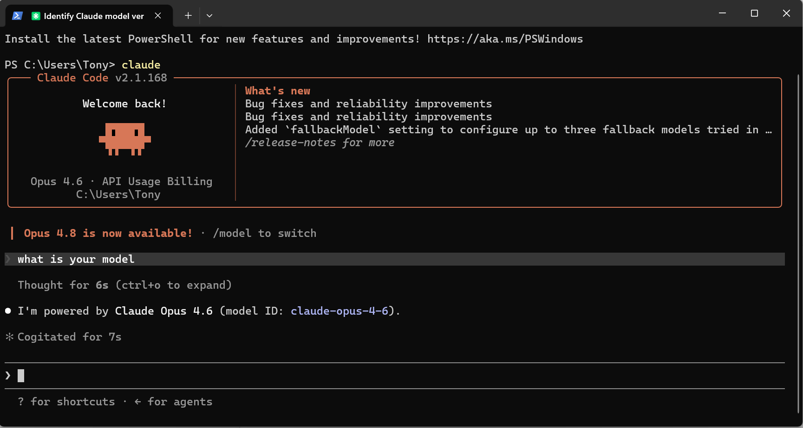

หน้าแรกของ CC-Switch สำหรับ Claude

## 3. เลือก Custom Configuration

ในหน้า Add New Provider ให้เลือก Custom Configuration เพื่อกรอกข้อมูล TinyToken เอง

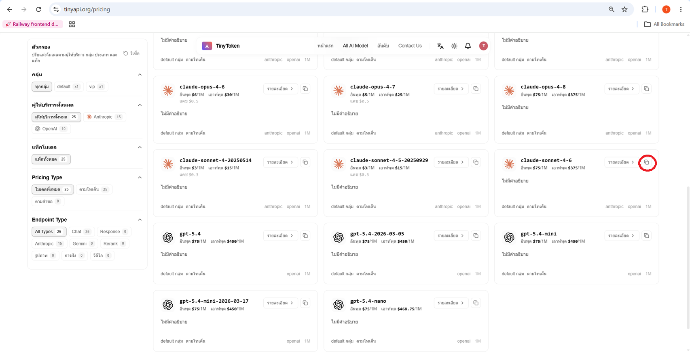

เลือก Custom Configuration

## 4. คัดลอก API Key จาก TinyToken

เปิด https://tinyapi.org/keys แล้วกดปุ่มคัดลอก API Key

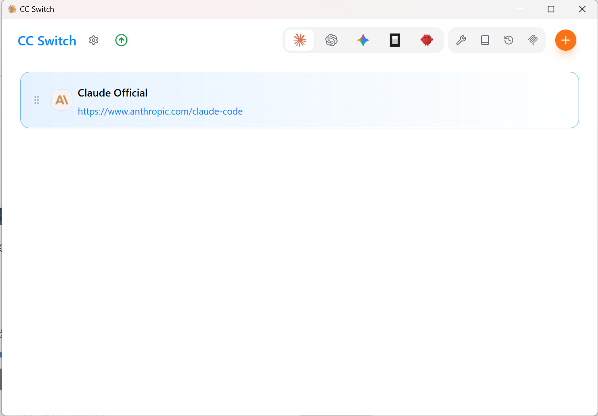

คัดลอก API Key จากหน้า TinyToken

## 5. กรอก Provider ของ TinyToken

Provider Name: TinyToken

Website URL: https://tinyapi.org

API Key: วาง API Key ที่คัดลอกมา

API Endpoint: https://api.tinyapi.org

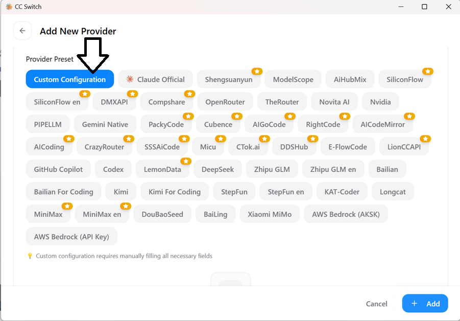

กรอก URL, API Key และ Endpoint

## 6. ตั้งค่า Advanced Options

เปิด Advanced Options

API Format: Anthropic Messages (Native)

Auth Field: ANTHROPIC_AUTH_TOKEN (Default)

Main Model: claude-opus-4-6 หรือโมเดลที่ต้องการ แล้วกด Add / Save

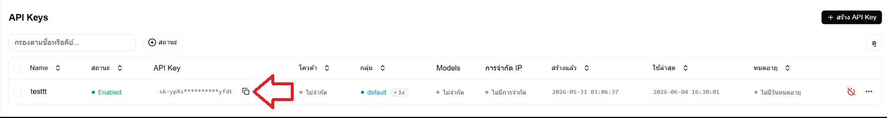

ตั้งค่า API Format และ Main Model

## 7. เปิดใช้งาน Provider

กลับมาหน้าหลักแล้วกด Enable ให้ TinyToken ขึ้นสถานะ In Use

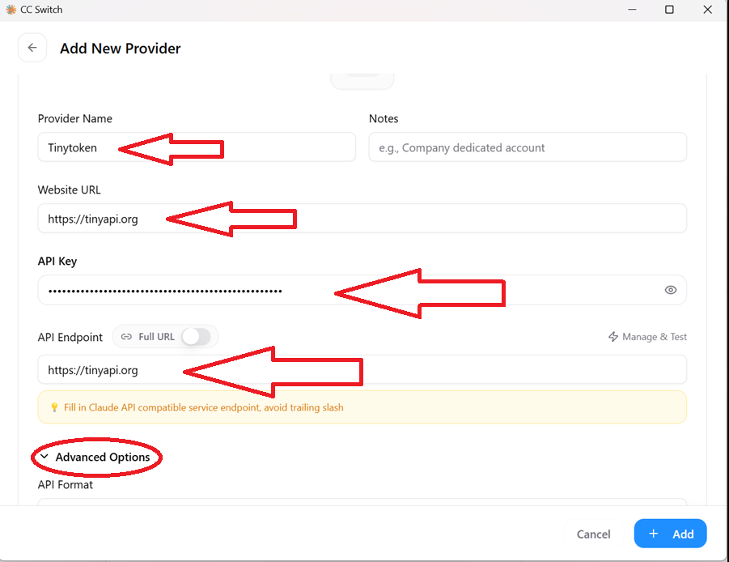

TinyToken แสดงสถานะ In Use

## 8. ตั้งค่า Skip first-run confirmation

ไปที่ Settings > General แล้วเปิด Skip Claude Code first-run confirmation

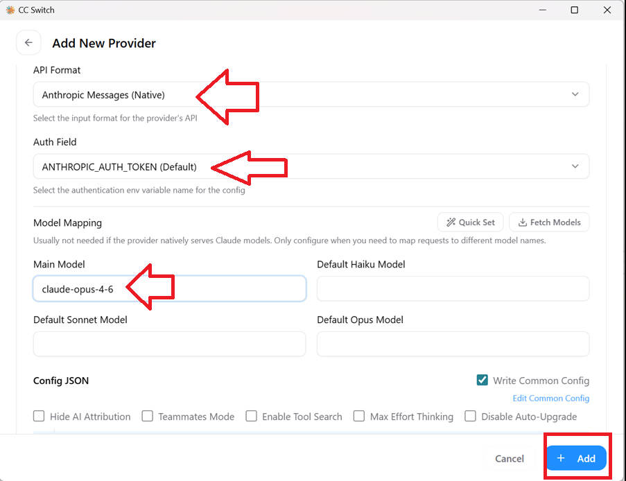

เปิด Skip Claude Code first-run confirmation

## 9. ทดสอบใน Terminal

เปิด PowerShell หรือ Terminal แล้วพิมพ์ claude ถ้ามีหน้าให้ยืนยัน ให้เลือก Yes, I trust this folder

**Command**

```
claude
```

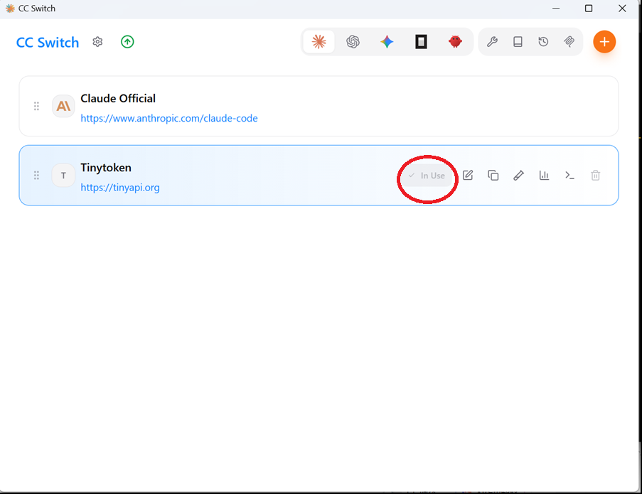

เลือก Yes, I trust this folder

## 10. ตรวจสอบว่าใช้งานได้

ลองถามว่า what is your model ถ้า Claude ตอบกลับได้ แปลว่าตั้งค่าสำเร็จ

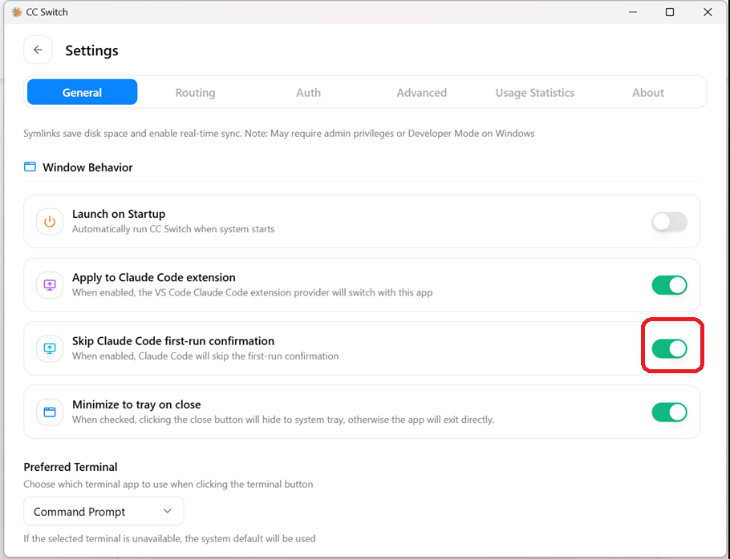

Claude Code ใช้งานผ่าน TinyToken สำเร็จ

## หมายเหตุ

- ถ้าจะเปลี่ยนโมเดล ให้คัดลอกชื่อโมเดลจากหน้า All AI Model / Pricing ของ TinyToken
- ถ้า API ไม่ทำงาน ให้ตรวจสอบ API Key, Endpoint และสถานะ In Use อีกครั้ง

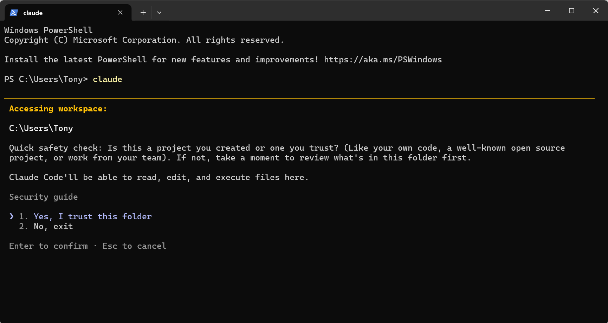

คัดลอกชื่อโมเดลจากหน้า TinyToken
