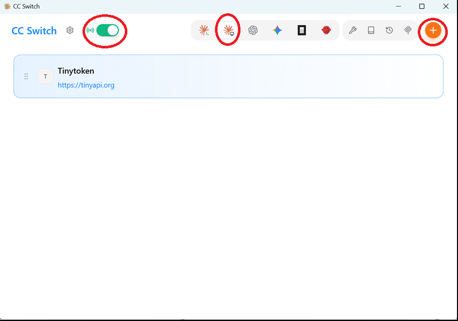
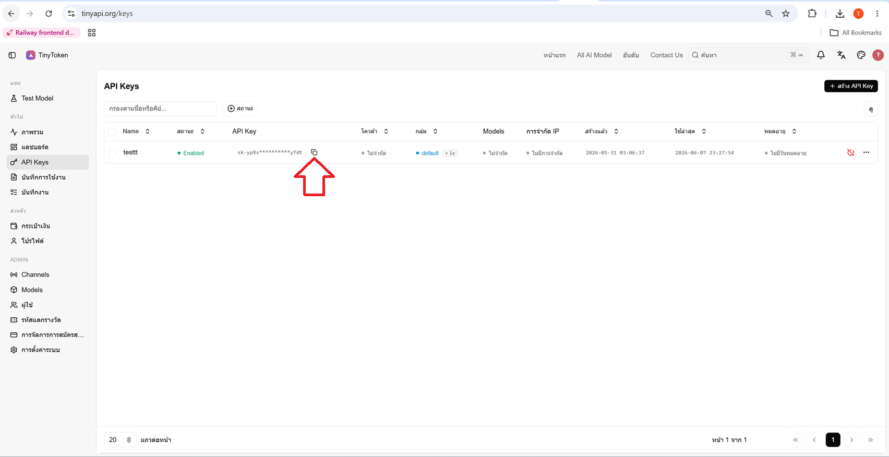
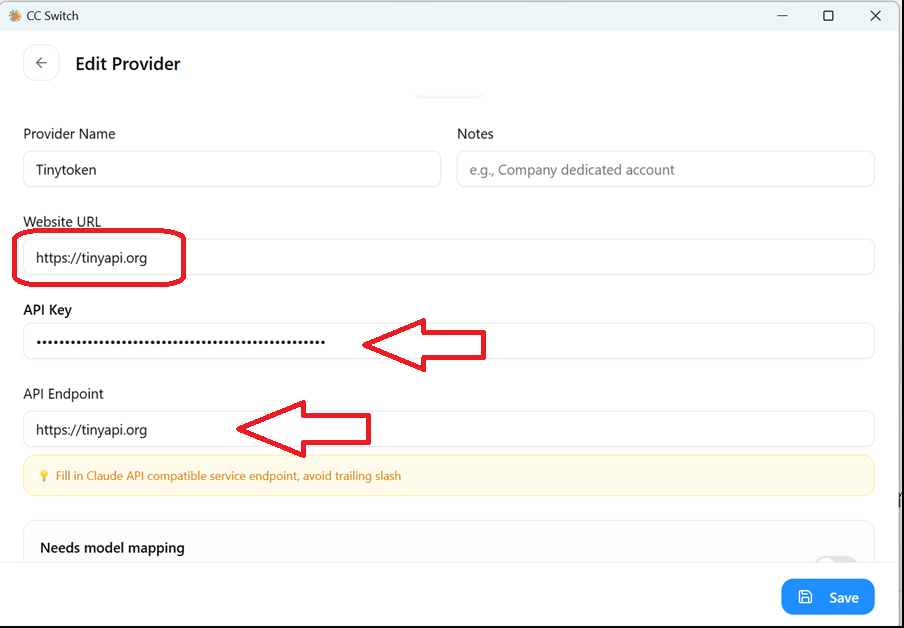
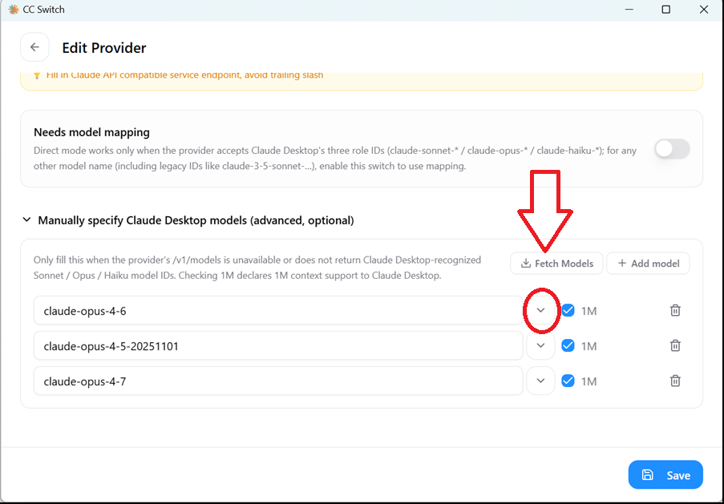
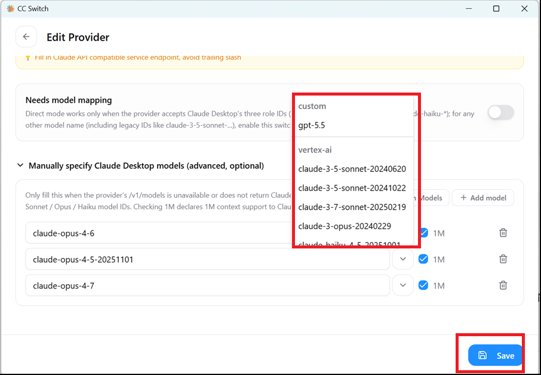
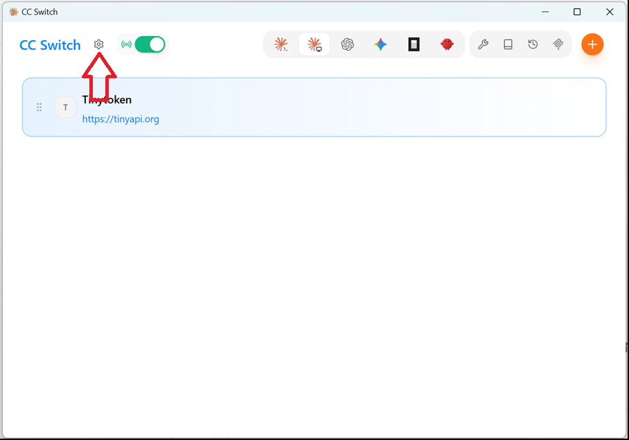
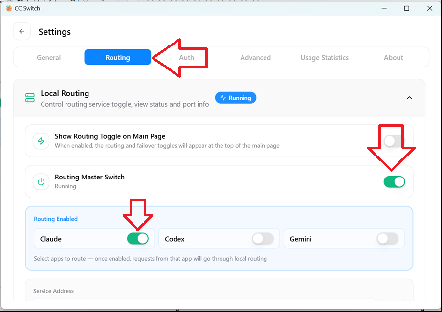
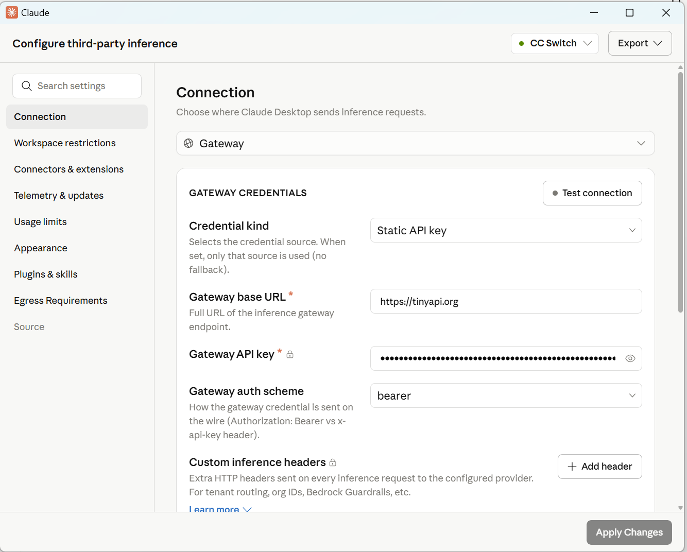
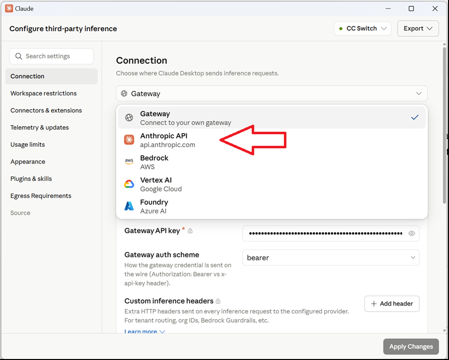

# Claude Desktop ตั้งค่า

## คู่มือใช้งาน Claude Desktop กับ TinyToken

**CC-Switch ใช้งาน** · 2026/6/8 · อ่านไม่เกิน 5 นาที

คู่มือใช้งาน Claude Desktop กับ TinyToken ผ่าน CC-Switch

## 1. เปิด CC-Switch แล้วเลือก Claude Desktop

ในหน้า CC-Switch ให้เลือกไอคอน Claude Desktop จากนั้นกดปุ่ม + เพื่อเพิ่ม Provider ใหม่

            

เลือก Claude Desktop แล้วกด +

## 2. คัดลอก API Key จาก TinyToken

เปิดหน้า API Keys ใน TinyToken แล้วกดปุ่มคัดลอก API Key

            

คัดลอก API Key จาก TinyToken

## 3. กรอก API Key และ Endpoint

Provider Name: TinyToken

Website URL: https://tinyapi.org

API Key: วาง API Key ที่คัดลอกมา

API Endpoint / Base URL: https://api.tinyapi.org แล้วกด Save

            

กรอก API Key และ Endpoint

## 4. ดึงรายชื่อโมเดล

กด Fetch Models เพื่อให้ CC-Switch ดึงรายชื่อโมเดลจาก TinyToken

            

กด Fetch Models

## 5. เลือกโมเดลที่ต้องการ

เลือกโมเดล เช่น claude-opus-4-6, claude-opus-4-7 หรือ claude-sonnet รุ่นที่ต้องการ แล้วกด Save

            

เลือกโมเดลและกด Save

## 6. เปิด Routing ใน CC-Switch

ไปที่ Settings > Routing แล้วเปิด Show Routing Toggle on Main Page, Routing Master Switch และเปิด Claude

            

เปิด Routing Master Switch และ Claude

## 7. เปิด Inference configuration ใน Claude Desktop

ใน Claude Desktop ให้เปิดเมนูด้านซ้ายล่าง แล้วเลือก Inference configuration

            

เปิด Inference configuration

## 8. เลือก Gateway และทดสอบ

ใน Connection ให้เลือก Gateway ใส่ https://api.tinyapi.org และ API Key จากนั้นกด Test connection และ Test model discovery

            

ตั้งค่า Gateway และทดสอบการเชื่อมต่อ

## 9. Apply แล้วเริ่มใช้งาน

กด Apply Changes แล้วปิด Claude Desktop ให้สนิท จากนั้นเปิดใหม่อีกครั้ง

## 1. ใน Claude Desktop

ไปที่ Inference configuration > Connection แล้วเลือก Anthropic API จากนั้นกด Apply Changes และเปิด Claude Desktop ใหม่

            

เลือก Anthropic API เพื่อกลับไปใช้ Claude Desktop แบบเดิม

## 2. ใน CC-Switch

อีกวิธีคือเลือก Claude Desktop Official แล้วกด Enable จากนั้นปิดและเปิด Claude Desktop ใหม่

## Prompt สำหรับ Codex

ใช้เนื้อหาและรูปในเอกสารนี้สร้างหน้า API Docs ภาษาไทยสำหรับหัวข้อ “วิธีใช้งาน Claude Desktop กับ TinyToken ผ่าน CC-Switch” จัดลำดับขั้นตอน 1-9 ให้สั้น อ่านง่าย และใส่ส่วนท้าย “วิธีกลับไปใช้ Claude Desktop แบบเดิม”
