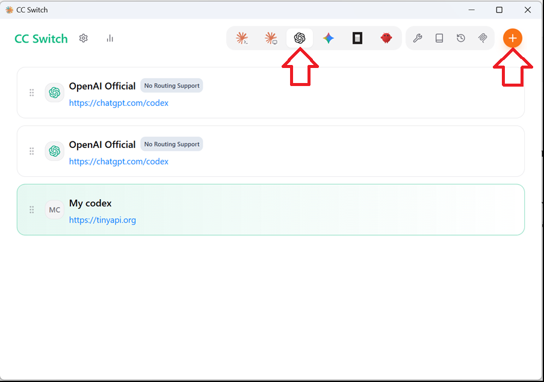
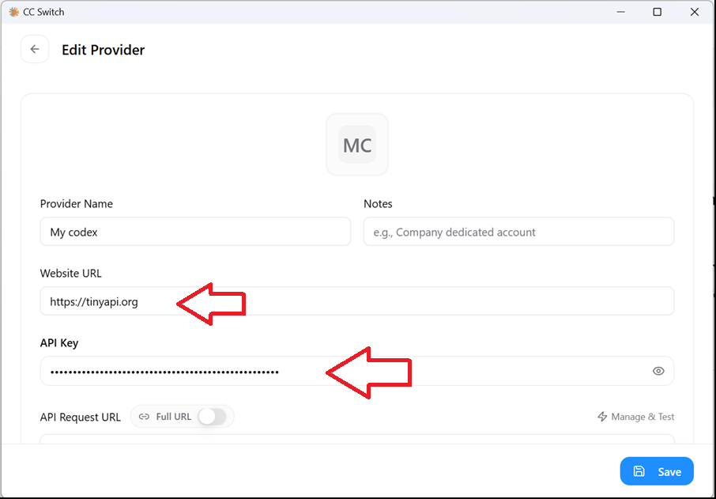
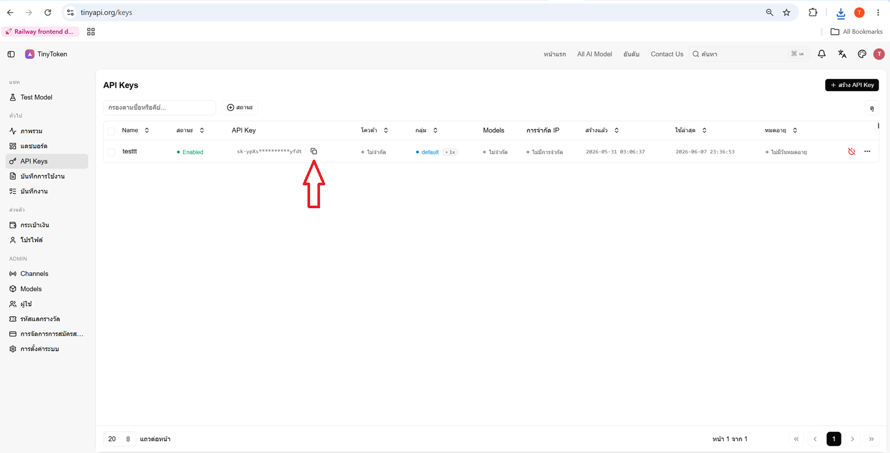
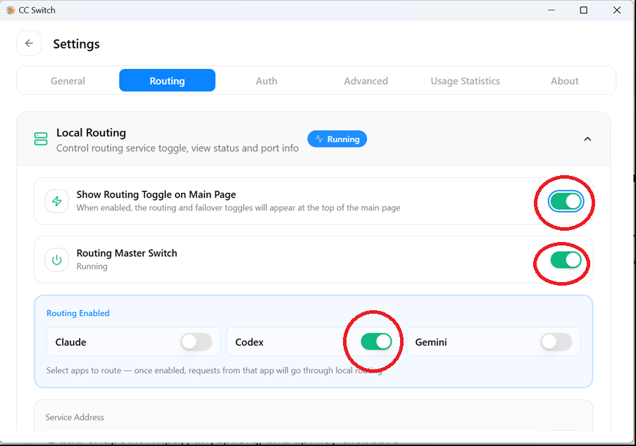
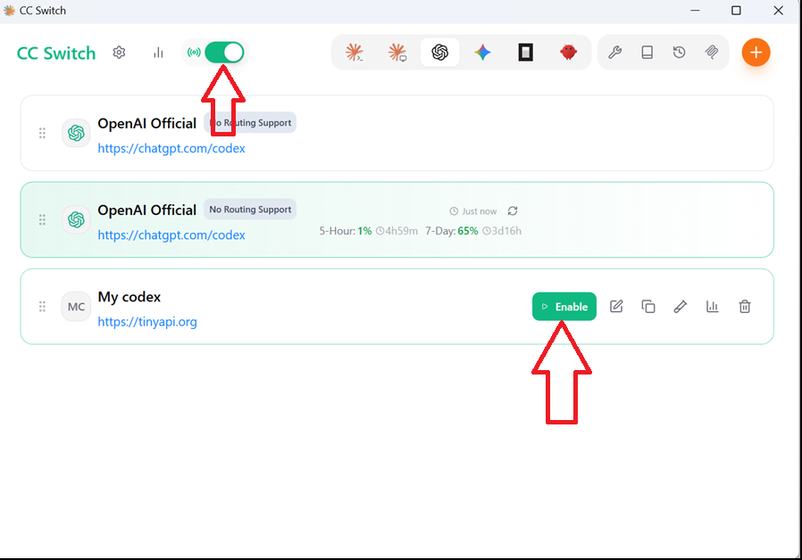
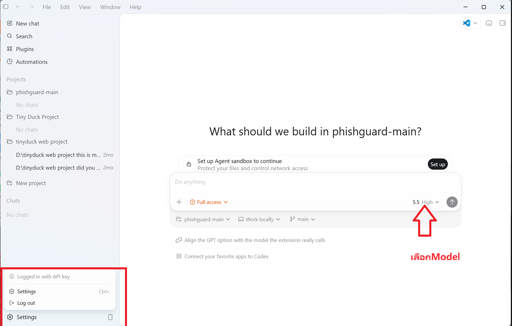

# Codex ตั้งค่า

## คู่มือใช้งาน Codex กับ TinyToken

**CC-Switch ใช้งาน** · 2026/6/8 · อ่านไม่เกิน 5 นาที

คู่มือใช้งาน Codex กับ TinyToken ผ่าน CC-Switch

## 1. เปิด CC-Switch แล้วเลือก Codex

ใน CC-Switch ให้กดไอคอน Codex จากนั้นกดปุ่ม + เพื่อเพิ่ม Provider ใหม่

            

เลือก Codex แล้วกด +

## 2. เพิ่ม Provider ของ TinyToken

Provider Name: My codex หรือ TinyToken

Website URL: https://tinyapi.org

วาง API Key ในช่อง API Key

API Request URL / Endpoint: https://api.tinyapi.org แล้วกด Save

            

ใส่ Website URL และ API Key

## 3. คัดลอก API Key จาก TinyToken

เปิด https://tinyapi.org/keys แล้วกดปุ่มคัดลอก API Key จากแถวที่ต้องการ

            

คัดลอก API Key จาก TinyToken

## 4. เปิด Routing

ไปที่ Settings > Routing แล้วเปิด Show Routing Toggle on Main Page, Routing Master Switch และเปิด Codex

            

เปิด Routing สำหรับ Codex

## 5. เปิดใช้ Provider TinyToken

กลับไปหน้า Codex ใน CC-Switch แล้วกด Enable ที่ Provider ของ TinyToken

            

กด Enable ให้ Provider TinyToken

## 6. Restart Codex แล้วเลือกโมเดล

ปิด Codex ให้สนิทแล้วเปิดใหม่ ตอนนี้ควรขึ้นว่า Logged in with API key และสามารถเลือกโมเดลที่ต้องการใช้งานได้

            

Codex ใช้งานด้วย API Key และเลือกโมเดลได้

## สรุปค่าที่ต้องใช้

            - Website URL: https://tinyapi.org
            - API Key: คัดลอกจากหน้า TinyToken API Keys
            - Routing: เปิด Routing Master Switch และ Codex
            - หลังตั้งค่าเสร็จ ให้ restart Codex ก่อนใช้งาน

## Prompt สำหรับ Codex

{"สร้างหน้าเอกสาร API Docs ภาษาไทยชื่อ \"วิธีใช้งาน Codex กับ TinyToken ผ่าน CC-Switch\" โดยใช้ขั้นตอนจากไฟล์นี้ จัดเนื้อหาเป็น 1) เปิด CC-Switch เลือก Codex และเพิ่ม Provider 2) ใส่ endpoint https://api.tinyapi.org และ API Key 3) เปิด Routing: Show Routing Toggle, Routing Master Switch และ Codex 4) Enable Provider TinyToken 5) Restart Codex แล้วเลือกโมเดล ใช้ภาษาไทยสั้น เข้าใจง่าย และใส่รูปประกอบตามลำดับ"}
