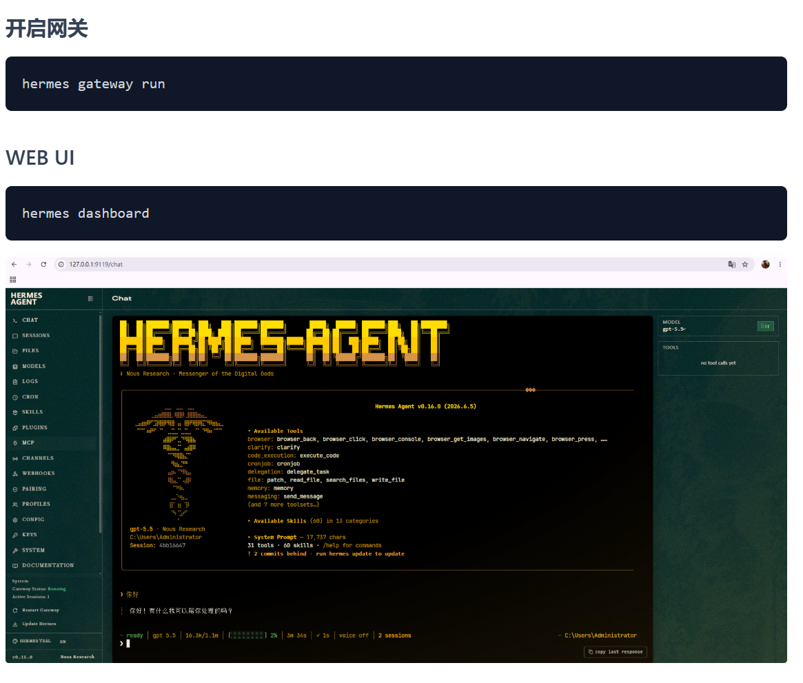

# Hermes Agent ตั้งค่า

**CC-Switch ใช้งาน** · 2026/6/12 · อ่านประมาณ 6 นาที

คู่มือภาษาไทยสำหรับติดตั้ง Hermes Agent และเชื่อมต่อกับ TinyAPI ผ่าน endpoint ของ TinyToken

## Hermes Agent คืออะไร

Hermes Agent เป็นเครื่องมือ AI agent ที่ใช้งานผ่าน command line และมี Web UI
สำหรับเปิด gateway / dashboard ได้ คู่มือนี้จะตั้งให้ Hermes เรียกโมเดลผ่าน
TinyAPI โดยใช้ API Key ที่ขึ้นต้นด้วย `sk-`


>
สำหรับ TinyAPI ให้เริ่มจากรูปแบบ OpenAI-compatible ก่อน โดยใช้ endpoint
`https://api.tinyapi.org/v1` ถ้าโปรแกรมถามหา base URL แบบมี
`/v1`

## ติดตั้ง Hermes

บน Windows ให้เปิด PowerShell แล้วรันคำสั่งติดตั้งนี้

**Windows PowerShell**

```
irm https://hermes-agent.nousresearch.com/install.ps1 | iex
```

บน Linux / macOS / WSL2 / Android Termux ให้ใช้คำสั่งนี้

**Linux / macOS**

```
curl -fsSL https://hermes-agent.nousresearch.com/install.sh | bash
```

**ตรวจเวอร์ชัน**

```
hermes --version
```

## เลือกโมเดลและ endpoint

หลังติดตั้งเสร็จ ให้เปิด Terminal แล้วรันคำสั่งเลือก provider / model
จากนั้นเลือก custom endpoint ตามรูปตัวอย่าง

**เปิดเมนูโมเดล**

```
hermes model
```

**API Base URL**

```
${apiUrl
```

**API Key**

```
sk-xxxxxxxxxxxxxxxxxxxxxxxxxxxxxxxx
```

**ตัวอย่างโมเดล**

```
claude-opus-4-7
```

**Display name**

```
tinytoken
```

- ในหน้า provider ให้เลือก `Custom endpoint` หรือ custom
OpenAI-compatible endpoint
- ช่อง API base URL ให้ใส่ `https://api.tinyapi.org/v1`
- ช่อง API key ให้วางคีย์จากหน้า `https://tinyapi.org/keys`
- เลือก compatibility mode เป็น Auto-detect หรือ Chat Completions
- ใส่ชื่อโมเดลจริงจากหน้า Pricing / All AI Model ของเว็บคุณ

{hermesImages.slice(1, 3).map((image, index) => (

))}

## ตั้งค่าใน CC-Switch

ถ้าใช้ CC-Switch ช่วยจัดการ provider ให้เลือกแท็บ Hermes แล้วเพิ่ม Provider ใหม่
ด้วย Custom Configuration

- เปิด CC-Switch แล้วเลือกไอคอน Hermes
- กดปุ่ม + เพื่อเพิ่ม provider ใหม่
- เลือก Provider Preset เป็น Custom Configuration
- Provider Key ใช้ `tinyapi`
- API Endpoint ใช้ `https://api.tinyapi.org` ถ้าเลือก API Mode เป็น Anthropic
Messages หรือใช้ `https://api.tinyapi.org/v1` ถ้าเลือก OpenAI-compatible
- วาง API Key และกด Fetch Models แล้วเลือกโมเดลที่ต้องการ
- กด Save แล้วกลับไปทดสอบใน Hermes

{hermesImages.slice(3, 6).map((image, index) => (

))}

## เปิด Gateway และ Web UI

เมื่อตั้งค่าโมเดลแล้ว สามารถเปิด gateway และ dashboard ของ Hermes ได้ด้วยคำสั่งนี้

**เปิด gateway**

```
hermes gateway run
```

**เปิด dashboard**

```
hermes dashboard
```

เมื่อ dashboard เปิดแล้ว ให้ลองส่งข้อความสั้น ๆ เพื่อตรวจว่าระบบเรียกโมเดลผ่าน TinyAPI
ได้จริง



## ตรวจสอบก่อนใช้งาน

- API Key ต้องขึ้นต้นด้วย `sk-` และบัญชีมียอดคงเหลือ
- ถ้าใช้ custom OpenAI-compatible endpoint ให้ใช้ `https://api.tinyapi.org/v1`
- ชื่อโมเดลต้องตรงกับหน้า Pricing / All AI Model ทุกตัวอักษร
- ถ้า Fetch Models ไม่ขึ้น ให้ลองเช็ก API Mode และ endpoint อีกครั้ง
- หลังแก้ provider แล้ว ให้ปิด Hermes / CC-Switch แล้วเปิดใหม่ถ้าค่าไม่อัปเดต
