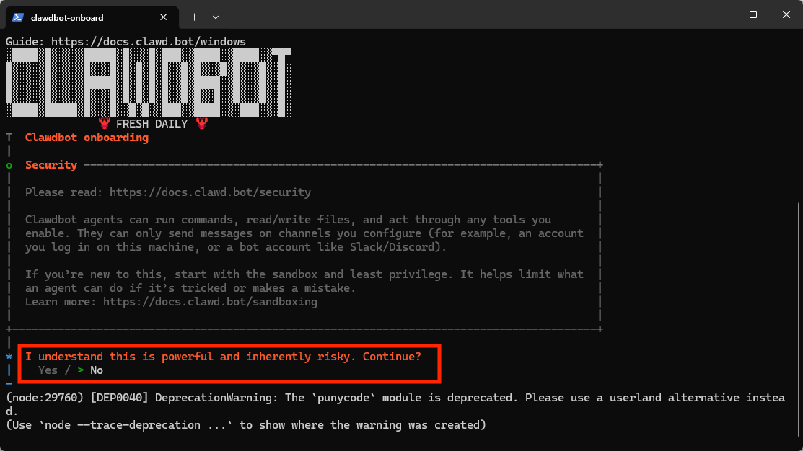
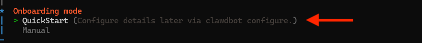
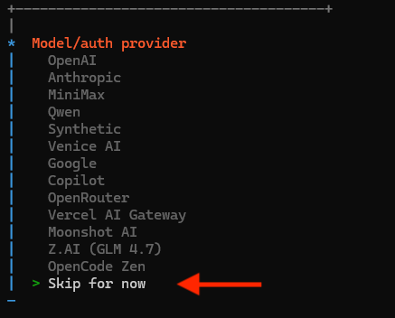
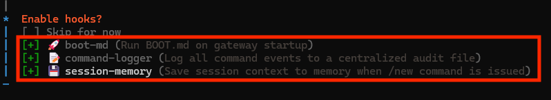

# OpenClaw ตั้งค่า

**CC-Switch ใช้งาน** · 2026/6/12 · อ่านประมาณ 6 นาที

คู่มือภาษาไทยสำหรับติดตั้ง OpenClaw และเชื่อมต่อกับ TinyToken ผ่าน API Endpoint ของ TinyAPI

## OpenClaw คืออะไร

            OpenClaw เป็นเครื่องมือ AI assistant / agent gateway ที่สามารถรันบนเครื่องของผู้ใช้
            และเชื่อมต่อกับช่องทางแชตหรือเครื่องมือหลายแบบได้ เช่น Telegram, Discord,
            WhatsApp, iMessage และช่องทางอื่น ๆ

            คู่มือนี้จะอธิบายวิธีติดตั้ง OpenClaw และตั้งค่าให้เรียกใช้โมเดลผ่าน
            TinyToken โดยใช้ API Key ที่ขึ้นต้นด้วย `sk-`

            

## ติดตั้ง OpenClaw

บน MacOS / Linux ให้เปิด Terminal แล้วรันคำสั่งนี้

          **MacOS / Linux**

```
curl -fsSL https://openclaw.ai/install.sh | bash
```

บน Windows แนะนำให้ติดตั้งและใช้งานผ่าน WSL2 ก่อน จากนั้นรันคำสั่งนี้

          **Windows PowerShell**

```
iwr -useb https://openclaw.ai/install.ps1 | iex
```

**ตรวจเวอร์ชัน**

```
openclaw --version
```

            

## เริ่มตั้งค่า OpenClaw

หลังติดตั้งเสร็จ ให้เปิดตัวช่วยตั้งค่าแบบ interactive ด้วยคำสั่งนี้

          **Command**

```
openclaw onboard
```

            

## ตั้งค่าระหว่าง onboarding

            - เมื่อเจอหน้า Onboarding mode ให้เลือก QuickStart
            - ในขั้นตอน Model/auth provider ให้เลือก Skip for now
            - ในหน้า Filter models by provider ให้เลือก All providers
            - ในขั้นตอน Default model ให้เลือก Keep current
            - ถ้ายังไม่ต้องการเชื่อม Telegram, Discord หรือช่องทางแชตอื่น ให้เลือก Skip for now
            - ในขั้นตอน Skills สามารถเลือก Skip for now หรือเลือกเฉพาะ skill ที่ต้องใช้
            - ถ้ามีหน้าถาม Enable hooks แนะนำให้เลือก boot-md, command-logger และ session-memory

            {openClawImages.slice(3, 7).map((image, index) => (

            ))}

>
            เมื่อตั้งค่าเสร็จ OpenClaw อาจเปิดหน้า gateway ผ่าน browser ให้อัตโนมัติ
            ถ้า gateway ยังไม่เปิด ให้รันคำสั่ง `openclaw gateway`

## เชื่อมต่อ TinyToken API

หลังติดตั้ง OpenClaw เสร็จ ให้เปิดโฟลเดอร์ config ของ OpenClaw

          **MacOS / Linux**

```
open ~/.openclaw
```

**VS Code**

```
code ~/.openclaw/openclaw.json
```

            API Key ให้คัดลอกจากหน้า `https://tinyapi.org/keys` และต้องขึ้นต้นด้วย
            `sk-`

>
            ถ้าใช้ `anthropic-messages` ให้ใช้
            `https://api.tinyapi.org` ไม่ต้องเติม `/v1`
            แต่ถ้าใช้ `openai-completions` ให้ใช้
            `https://api.tinyapi.org/v1`

            

## ตัวอย่าง config สำหรับ TinyToken

            เปิดไฟล์ `openclaw.json` แล้วเพิ่มหรือปรับ config ส่วน
            `models` ให้ใช้ TinyToken ตัวอย่างนี้ใช้
            `anthropic-messages` สำหรับโมเดล Claude

## รีสตาร์ท gateway

หลังบันทึก openclaw.json แล้ว ให้รีสตาร์ท gateway

          **Restart**

```
openclaw gateway restart
```

            จากนั้นเปิดหน้า gateway แล้วตรวจว่า provider และโมเดลของ TinyToken แสดงถูกต้อง
            ถ้าเชื่อมต่อไม่ได้ ให้ตรวจ API Key, ยอดคงเหลือ, endpoint และชื่อโมเดลอีกครั้ง
