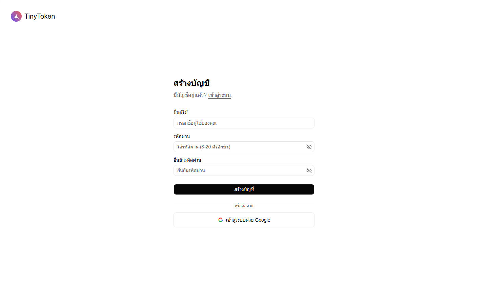

# (1) สมัครบัญชี

## สมัครบัญชี

**Quick Start** · 2026/6/8 · อ่านไม่เกิน 1 นาที

หน้านี้แยกเฉพาะขั้นตอนสมัครบัญชี TinyToken เท่านั้น ไม่ปนกับการเข้าสู่ระบบ

## เข้าสู่หน้าสมัครบัญชี

            - เปิดหน้าแรกของ TinyToken แล้วกดปุ่มสมัครบัญชี หรือเปิดลิงก์สมัคร
              โดยตรงจากด้านบน
            - ถ้าคุณอยู่หน้าเข้าสู่ระบบ ให้กดลิงก์ด้านล่างฟอร์มเพื่อไปหน้าสมัคร

## วิธีที่หนึ่ง (แนะนำ): ใช้ Google

            - กดปุ่ม **เข้าสู่ระบบด้วย Google**
            - เลือกบัญชี Google ที่ต้องการผูกกับ TinyToken แล้วอนุญาตการใช้งาน
            - เมื่ออนุญาตสำเร็จ ระบบจะสร้างบัญชีและเข้าสู่ระบบให้โดยอัตโนมัติ

            สมัครด้วย Google ไม่ต้องตั้งรหัสผ่านเพิ่ม หลังจากนี้ใช้บัญชี Google
            เดิมเพื่อเข้าใช้งานครั้งต่อไปได้เลย

## วิธีที่สอง: ใช้ชื่อผู้ใช้

            - กรอกชื่อผู้ใช้ที่ต้องการใช้งาน
            - ตั้งรหัสผ่านและกรอกรหัสผ่านซ้ำให้ตรงกัน
            - กดปุ่ม **สร้างบัญชี** แล้วทำตามข้อความที่ระบบแจ้งบนหน้าเว็บ

          

คำแนะนำ

              ควรใช้รหัสผ่านที่เดายาก และเก็บข้อมูลเข้าสู่ระบบไว้ให้ปลอดภัย
              เพื่อป้องกันไม่ให้ผู้อื่นเข้าถึงเครดิตและ API Key ในบัญชีของคุณ
